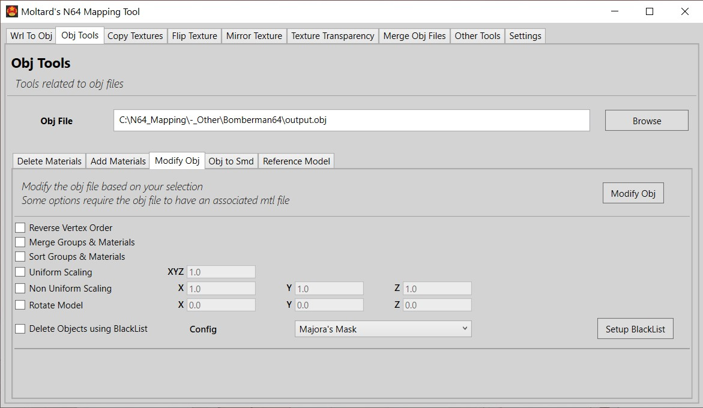

# /!\ 2023 - There are new ways for ripping Nintendo 64 scenes and textures

My guide is still correct and can be followed with them, but you can first use those new addons, plugins and better emulators to get stuff into Blender.
Although my tool may not have much use anymore.

## GLideN64-SceneRipper

https://github.com/Luctaris/GLideN64-SceneRipper

It's a plugin to be used with the emulator RMG (Rosalie's Mupen GUI).

It can output game textures (.png format) and the scene as a model (.glr format).

It's a modification of the 'GLideN64' video plugin, which is one of the most stable plugin for emulation.

This edit was done by a person which had helped me a lot regarding N64 stuff, years ago (Frozenstate/Luctaris).

All informations to install and use it are in the README

## blender-import-glr

https://github.com/Luctaris/blender-import-glr

Blender addon, to import the scene ripped by the plugin (.glr format).

## RMG (Rosalie's Mupen GUI)

https://github.com/Rosalie241/RMG

One of the newer Nintendo64 Emulator (a lot of improvement compared to Project64).

Support a lot of plugins, including the GLideN64-SceneRipper.

---

# Nintendo 64 Mapping Tool

A GUI tool to convert WRL files to OBJ, modify OBJ files, modify pictures and other stuff.

This tool is part of a big guide about ripping Nintendo 64 models to Source Engine, and recreating Nintendo 64 maps in Source Engine.

Link to the guide description on Gamebanana: 

- https://gamebanana.com/tuts/13280

Direct link to the PDF guide: 

- https://drive.google.com/file/d/11W7eTBbxmHoeC2_DS6gb9eUHxYvgZpBi/view

## Download

[N64MappingTool](https://github.com/Moltard/N64MappingTool/releases/latest)

## How to use

You can find all the informations on the Gamebanana post of the map as well as in the guide:

- https://gamebanana.com/tools/6797
- You will also find useful files used in the guide that you can download

