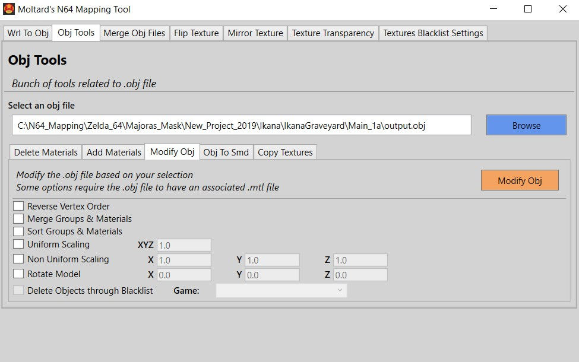

## Nintendo 64 Mapping Tool

A GUI tool to convert WRL files to OBJ, modify OBJ files, modify pictures and other stuff.

This tool is part of a big guide about ripping Nintendo 64 models to Source Engine, and recreating Nintendo 64 maps in Source Engine.

Link to the guide description on Gamebanana: 

- https://gamebanana.com/tuts/13280

Direct link to the PDF guide: 

- https://drive.google.com/file/d/11W7eTBbxmHoeC2_DS6gb9eUHxYvgZpBi/view

## Download

[N64MappingTool Current Version](https://github.com/Moltard/N64MappingTool/releases/latest)

## How to use

You can find all the informations on the Gamebanana post of the map as well as in the guide:

- https://gamebanana.com/tools/6797
- You will also find useful files used in the guide that you can download

